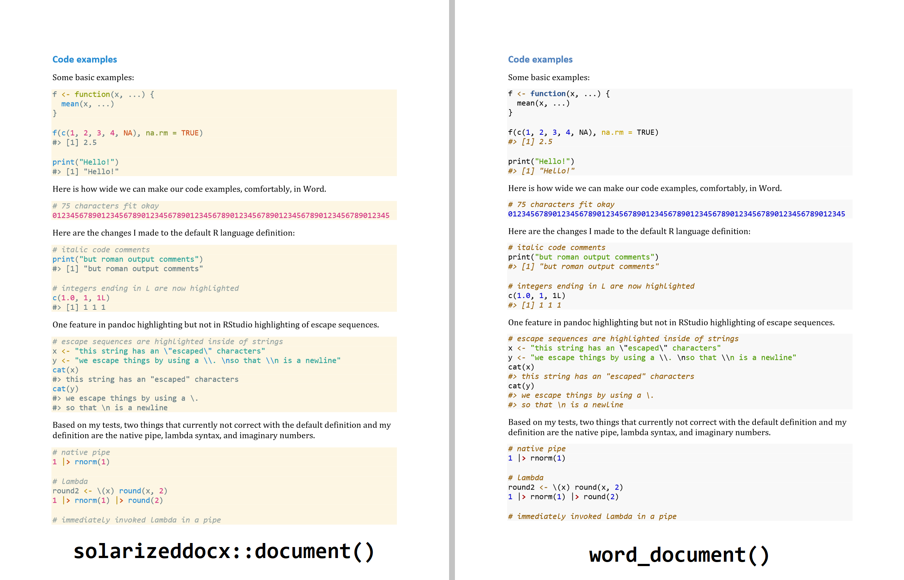

<!-- README.md is generated from README.Rmd. Please edit that file -->

# solarizeddocx

<!-- badges: start -->

[](https://github.com/tjmahr/solarizeddocx/actions)
<!-- badges: end -->



solarizeddocx provides an [RMarkdown](https://rmarkdown.rstudio.com/)
output format to create a docx file with
[solarized](https://github.com/altercation/solarized) syntax
highlighting. It works by provide custom style files to
[pandoc](https://pandoc.org/MANUAL.html).

Currently only the light solarized theme is supported.

## Installation

You can install the development version of solarizeddocx from
[GitHub](https://github.com/) with:

``` r
# install.packages("devtools")
devtools::install_github("tjmahr/solarizeddocx")
```

## Usage

This format can be used via YAML metadata.

    output: 
      solarizeddocx::document: default

Or explicitly with rmarkdown:

``` r
rmarkdown::render(
  "README.Rmd", 
  output_format = solarizeddocx::document()
)
```

## Customization

The built-in demo function will render a vignette detailing all of the
customizations used by the package.

``` r
solarizeddocx::demo_document()
```
